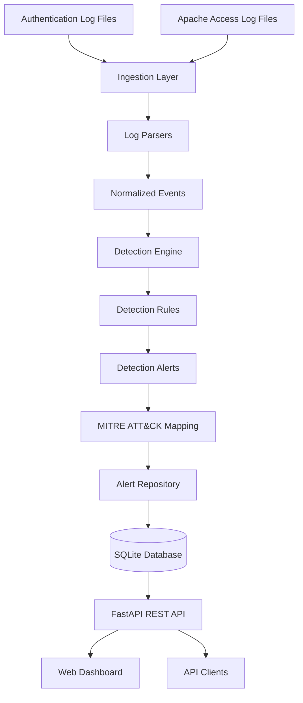

# Threat Detection Platform

A rule-based cybersecurity Threat Detection Platform built with Python and FastAPI.

The platform ingests Linux authentication logs and Apache/Nginx access logs, parses and normalizes security events, applies detection rules, enriches generated alerts with MITRE ATT&CK techniques and tactics, persists alerts in SQLite, and exposes the results through a REST API and web dashboard.

The project demonstrates practical detection-engineering concepts including:

- Security log ingestion
- Log parsing
- Event normalization
- Rule-based threat detection
- Threshold and time-window detection
- Signature-based web attack detection
- MITRE ATT&CK enrichment
- Alert persistence
- Alert filtering and pagination
- REST API development
- Web-based alert investigation
- Docker deployment
- Automated testing

---

## Table of Contents

- [Overview](#overview)
- [Key Features](#key-features)
- [Architecture](#architecture)
- [Detection Rules](#detection-rules)
- [MITRE ATT&CK Mapping](#mitre-attck-mapping)
- [Technology Stack](#technology-stack)
- [Project Structure](#project-structure)
- [Quick Start with Docker](#quick-start-with-docker)
- [Verify the Application](#verify-the-application)
- [Dashboard](#dashboard)
- [API Usage](#api-usage)
- [Log Ingestion](#log-ingestion)
- [CLI Usage](#cli-usage)
- [Local Python Development](#local-python-development)
- [Testing](#testing)
- [Evaluation Results](#evaluation-results)
- [Performance Evaluation](#performance-evaluation)
- [Documentation](#documentation)
- [Demo](#demo)
- [Limitations](#limitations)
- [Future Development](#future-development)
- [License](#license)

---

## Overview

Security logs contain valuable information about authentication attempts, privilege escalation, account changes, web requests, and potential attacks. However, raw log files are difficult to investigate directly and require structured processing before suspicious activity can be identified.

This project implements a complete detection pipeline that transforms raw log files into structured security events and evaluates those events using independently testable detection rules.

The general workflow is:

```text
Raw Log Files
      ↓
Log Ingestion
      ↓
Log Parsing
      ↓
Event Normalization
      ↓
Detection Engine
      ↓
Detection Rules
      ↓
Alert Generation
      ↓
MITRE ATT&CK Enrichment
      ↓
Alert Repository
      ↓
SQLite Database
      ↓
FastAPI REST API
      ↓
Web Dashboard
```

The project is designed as a detection-engineering and cybersecurity portfolio project rather than a full production SIEM.

---

## Key Features

### Log Processing

- Linux authentication log parsing
- Apache/Nginx combined access-log parsing
- Streaming log readers
- Syslog timestamp handling
- Apache timestamp parsing with timezone support
- Query-string extraction
- User-Agent extraction
- Referer extraction
- Malformed-input handling

### Detection

The platform currently implements eight detection rules:

1. SSH Brute Force
2. Successful Authentication After Failures
3. Excessive Sudo
4. New User Creation
5. Directory Scanning
6. SQL Injection
7. Cross-Site Scripting (XSS)
8. Suspicious User Agent

### Alert Management

- Alert generation
- Alert persistence
- Alert lookup by ID
- Alert filtering
- Combined filters
- Date-range filtering
- Pagination
- Alert statistics
- MITRE ATT&CK enrichment

### API and Dashboard

- FastAPI REST API
- Interactive OpenAPI documentation
- File-upload ingestion endpoint
- Alert listing and retrieval
- Statistics endpoint
- Web dashboard
- Alert filtering
- Alert detail view
- Detection charts
- Empty-state handling

### Deployment and Quality

- Docker support
- Docker Compose deployment
- Persistent SQLite storage
- Automated test suite
- 95% code coverage
- Ruff linting
- End-to-end Docker validation

---

# Architecture

The architecture is intentionally modular so that log processing, normalization, detection, persistence, and presentation remain separated.



## Architecture Components

### 1. Ingestion Layer

Receives raw authentication and access log files and passes them into the appropriate processing pipeline.

### 2. Log Parsers

Parsers convert raw log lines into structured authentication or access events.

Supported inputs include:

- Linux authentication logs
- Apache/Nginx combined access logs

### 3. Normalization

Different log formats are transformed into a common normalized-event representation.

This allows detection rules to operate on a consistent event structure rather than handling individual log formats themselves.

### 4. Detection Engine

The detection engine evaluates normalized events against the configured detection rules.

Rules can use:

- Event conditions
- Thresholds
- Sliding time windows
- Pattern matching
- Indicator matching

### 5. MITRE ATT&CK Mapping

When a rule generates an alert, the platform enriches it with the corresponding MITRE ATT&CK technique and tactic.

### 6. Alert Repository

The repository layer provides database operations for:

- Saving alerts
- Retrieving individual alerts
- Listing alerts
- Filtering alerts
- Pagination
- Alert statistics

### 7. SQLite Database

Generated alerts are stored persistently using SQLite and SQLAlchemy.

Docker Compose uses a named volume so that the database survives container restarts.

### 8. FastAPI API

FastAPI exposes the platform functionality through REST endpoints for:

- Health checks
- Alert retrieval
- Alert filtering
- Alert statistics
- Log ingestion

### 9. Web Dashboard

The dashboard provides a browser-based interface for reviewing alerts, applying filters, viewing statistics, examining MITRE ATT&CK information, and investigating individual alerts.

---

# Detection Rules

| Rule | Log Type | Detection Method | Severity |
|---|---|---|---|
| SSH Brute Force | Authentication | Failed-login threshold + time window | High |
| Successful After Failures | Authentication | Failed-login threshold before success | High |
| Excessive Sudo | Authentication | Threshold + time window | High |
| New User Creation | Authentication | Event-based detection | High |
| Directory Scanning | Access | Path count + 404 ratio + time window | High |
| SQL Injection | Access | Pattern matching | High |
| XSS Attempt | Access | Pattern matching | High |
| Suspicious User Agent | Access | Indicator matching | Low |

Detailed detection logic, thresholds, severities, and MITRE ATT&CK mappings are documented in:

[`docs/final_report/detection_rules.md`](docs/final_report/detection_rules.md)

---

# MITRE ATT&CK Mapping

The implemented detection rules are mapped to MITRE ATT&CK techniques and tactics.

| Detection Rule | Technique | Tactic |
|---|---|---|
| SSH Brute Force | T1110 — Brute Force | Credential Access |
| Successful After Failures | T1110 — Brute Force | Credential Access |
| Excessive Sudo | T1548.003 — Sudo and Sudo Caching | Privilege Escalation |
| New User Creation | T1136.001 — Local Account | Persistence |
| Directory Scanning | T1595.003 — Wordlist Scanning | Reconnaissance |
| SQL Injection | T1190 — Exploit Public-Facing Application | Initial Access |
| XSS Attempt | T1189 — Drive-by Compromise | Initial Access |
| Suspicious User Agent | T1595.002 — Vulnerability Scanning | Reconnaissance |

MITRE mapping details are also available in:

[`docs/mitre_mapping_table.md`](docs/mitre_mapping_table.md)

---

# Technology Stack

| Component | Technology |
|---|---|
| Programming Language | Python 3.12 |
| API Framework | FastAPI |
| ASGI Server | Uvicorn |
| Database | SQLite |
| ORM | SQLAlchemy |
| Frontend | HTML, CSS, JavaScript |
| UI Framework | Bootstrap |
| Detection Engine | Custom Python implementation |
| Threat Framework | MITRE ATT&CK |
| Containerization | Docker |
| Orchestration | Docker Compose |
| Testing | pytest |
| Linting | Ruff |

---

# Project Structure

```text
threat-detection-platform/
│
├── app/
│   ├── api/
│   │   ├── main.py
│   │   └── routers/
│   │       ├── alerts.py
│   │       ├── ingest.py
│   │       └── stats.py
│   │
│   ├── detection/
│   │   ├── engine.py
│   │   ├── rule_base.py
│   │   └── rules/
│   │       ├── directory_scanning.py
│   │       ├── excessive_sudo.py
│   │       ├── new_user_creation.py
│   │       ├── sql_injection.py
│   │       ├── ssh_brute_force.py
│   │       ├── successful_after_failures.py
│   │       ├── suspicious_user_agent.py
│   │       └── xss_attempt.py
│   │
│   ├── mitre/
│   │   └── mapping.py
│   │
│   ├── models/
│   │   ├── access_event.py
│   │   ├── alert.py
│   │   ├── auth_event.py
│   │   ├── database.py
│   │   ├── db_alert.py
│   │   └── normalized_event.py
│   │
│   ├── parsers/
│   │   ├── access_log_reader.py
│   │   ├── apache_parser.py
│   │   ├── auth_log_reader.py
│   │   ├── cli_access_reader.py
│   │   ├── cli_auth_reader.py
│   │   ├── linux_parser.py
│   │   └── timestamp_utils.py
│   │
│   ├── repository/
│   │   └── alert_repository.py
│   │
│   └── services/
│       ├── detection_engine.py
│       ├── ingestion.py
│       └── normalizer.py
│
├── data/
│   └── sample_logs/
│       ├── access_sample.log
│       └── auth_sample.log
│
├── docs/
│   ├── final_report/
│   ├── database_schema_design.md
│   ├── detection_engine_design.md
│   ├── mitre_mapping_table.md
│   ├── performance_notes.md
│   └── testing.md
│
├── scripts/
│   ├── ingest.py
│   ├── init_db.py
│   ├── mitre_pipeline_dry_run.py
│   └── run_ingestion.py
│
├── static/
│   └── dashboard.html
│
├── tests/
│
├── Dockerfile
├── docker-compose.yml
├── requirements.txt
└── README.md
```

---

# Quick Start with Docker

Docker Compose is the recommended way to run the complete application.

## Prerequisites

Install:

- Git
- Docker
- Docker Compose

Verify Docker:

```bash
docker --version
docker compose version
```

## 1. Clone the Repository

```bash
git clone https://github.com/sakoleat-kh/threat-detection-platform.git
cd threat-detection-platform
```

## 2. Build and Start the Application

```bash
docker compose up --build -d
```

Check the container:

```bash
docker compose ps
```

The application will be available at:

```text
http://localhost:8000
```

## 3. Check Application Health

```bash
curl http://localhost:8000/health
```

Expected response:

```json
{"status":"ok"}
```

## 4. Open the Dashboard

Open the following URL in a browser:

```text
http://localhost:8000/static/dashboard.html
```

## 5. Open API Documentation

FastAPI provides interactive API documentation at:

```text
http://localhost:8000/docs
```

## 6. Stop the Application

```bash
docker compose down
```

The SQLite database is stored in the named Docker volume:

```text
threat_detection_data
```

The database therefore persists across normal container restarts.

To remove the containers and persistent database volume:

```bash
docker compose down -v
```

> **Warning:** `docker compose down -v` deletes the Docker volume containing the SQLite database.

---

# Verify the Application

After starting Docker Compose, verify the main API endpoints.

## Health

```bash
curl http://localhost:8000/health
```

Expected:

```json
{"status":"ok"}
```

## Alerts

```bash
curl http://localhost:8000/alerts/
```

## Statistics

```bash
curl http://localhost:8000/stats/
```

The statistics response contains alert counts grouped by:

- Detection rule
- MITRE technique
- MITRE tactic

---

# Dashboard

The web dashboard provides a graphical interface for alert investigation.

The dashboard supports:

- Alert table display
- Alert filtering
- Date-range filtering
- Alert refresh
- Alert detail view
- MITRE ATT&CK information
- Rule statistics
- Technique statistics
- Tactic statistics
- Detection charts
- Empty-state handling

Open the dashboard at:

```text
http://localhost:8000/static/dashboard.html
```

---

# API Usage

The application exposes a REST API through FastAPI.

## Health Check

```bash
curl http://localhost:8000/health
```

## List Alerts

```bash
curl http://localhost:8000/alerts/
```

## Retrieve an Alert

Replace `1` with an alert ID:

```bash
curl http://localhost:8000/alerts/1
```

## Alert Statistics

```bash
curl http://localhost:8000/stats/
```

## Filter by Rule

```bash
curl "http://localhost:8000/alerts/?rule_id=excessive_sudo"
```

## Filter by MITRE Technique

```bash
curl "http://localhost:8000/alerts/?technique_id=T1548.003"
```

## Filter by Source IP

```bash
curl "http://localhost:8000/alerts/?source_ip=192.168.1.10"
```

## Pagination

The alerts endpoint supports pagination through `limit` and `offset`.

Example:

```bash
curl "http://localhost:8000/alerts/?limit=10&offset=0"
```

## API Documentation

Interactive Swagger documentation:

```text
http://localhost:8000/docs
```

---

# Log Ingestion

The API provides a file-upload endpoint for ingesting supported logs.

The endpoint is:

```text
POST /ingest/
```

The request requires:

- `file`
- `log_type`

Supported log types include:

- `auth`
- `access`

---

## Authentication Log Ingestion

Using the included sample:

```bash
curl -X POST \
  -F "file=@data/sample_logs/auth_sample.log" \
  -F "log_type=auth" \
  http://localhost:8000/ingest/
```

Example response:

```json
{
  "lines_processed": 200,
  "alerts_generated": 1
}
```

---

## Apache Access Log Ingestion

Using the included sample:

```bash
curl -X POST \
  -F "file=@data/sample_logs/access_sample.log" \
  -F "log_type=access" \
  http://localhost:8000/ingest/
```

Example response:

```json
{
  "lines_processed": 200,
  "alerts_generated": 0
}
```

After ingestion, view the generated alerts:

```bash
curl http://localhost:8000/alerts/
```

Or open the dashboard:

```text
http://localhost:8000/static/dashboard.html
```

---

# CLI Usage

The project also provides command-line ingestion tools.

## Ingest Authentication and Access Logs

```bash
python -m scripts.ingest \
  --auth-log data/sample_logs/auth_sample.log \
  --access-log data/sample_logs/access_sample.log
```

## Ingest Only Authentication Logs

```bash
python -m scripts.ingest \
  --auth-log data/sample_logs/auth_sample.log
```

## Ingest Only Access Logs

```bash
python -m scripts.ingest \
  --access-log data/sample_logs/access_sample.log
```

The CLI provides ingestion and performance information including:

- Events processed
- Alerts generated
- Alerts saved
- Parsing and normalization time
- Detection and MITRE enrichment time
- Database persistence time
- Total runtime

---

# Local Python Development

Docker Compose is recommended for running the complete application.

For development and testing, the project can also be run directly with Python.

## Prerequisites

- Python 3.12
- pip
- Git

## 1. Create a Virtual Environment

### Linux/macOS

```bash
python3.12 -m venv venv
source venv/bin/activate
```

### Windows

```powershell
python -m venv venv
venv\Scripts\activate
```

## 2. Install Dependencies

```bash
pip install -r requirements.txt
```

## 3. Initialize the Database

```bash
python -m scripts.init_db
```

This creates the required SQLite database tables.

## 4. Start the API

```bash
uvicorn app.api.main:app --reload
```

The API will be available at:

```text
http://localhost:8000
```

Interactive API documentation:

```text
http://localhost:8000/docs
```

Dashboard:

```text
http://localhost:8000/static/dashboard.html
```

---

# Testing

The project includes automated tests covering:

- Log parsers
- Log readers
- Event normalization
- Detection rules
- Detection engine
- MITRE mapping
- Database functionality
- Alert repository
- Alert filtering
- API endpoints
- Integration workflows

## Run the Full Test Suite

```bash
python -m pytest -q
```

Current result:

```text
189 passed
```

## Run Ruff

```bash
ruff check app scripts tests
```

Expected result:

```text
All checks passed!
```

## Test Coverage

The final evaluation achieved:

```text
95% overall coverage
```

with:

```text
741 statements
39 missed
```

The remaining uncovered code consists primarily of intentional abstract behavior and thin CLI wrapper code.

More information is available in:

[`docs/testing.md`](docs/testing.md)

---

# Evaluation Results

The platform was evaluated using automated testing, representative log samples, API validation, dashboard testing, and Docker end-to-end testing.

## Automated Testing

```text
189 tests passed
1 known dependency warning
```

## Code Coverage

```text
95% overall coverage
741 statements
39 missed
```

## Authentication Log Test

```text
200 log lines processed
1 alert generated
```

## Access Log Test

```text
200 log lines processed
0 alerts generated
```

## MITRE Detection Pipeline

The MITRE pipeline dry run processed:

```text
400 normalized events
1 alert generated
```

The generated alert was associated with:

```text
T1548.003 — Sudo and Sudo Caching
Tactic: Privilege Escalation
```

## Docker Validation

The Docker deployment was tested for:

- Successful image build
- Successful container startup
- API health
- Authentication log ingestion
- Access log ingestion
- Alert retrieval
- Alert statistics
- Database persistence

Previously generated alerts remained available after stopping and restarting Docker Compose, confirming persistent SQLite storage through the named Docker volume.

More detailed evaluation information is available in:

[`docs/final_report/results.md`](docs/final_report/results.md)

---

# Performance Evaluation

A performance evaluation was performed using synthetic log data generated from the project's existing sample logs.

The benchmark processed 10,348 input lines:
- 5,174 authentication log lines
- 5,174 access log lines

Measured stages included:

- Parse and normalization
- Detection and MITRE enrichment
- Database persistence
- Total runtime

The performance evaluation is intended to demonstrate the behavior of the current implementation under the tested workload. It is not a claim of production-scale or enterprise-scale performance.

Detailed methodology and measurements are available in:

[`docs/performance_notes.md`](docs/performance_notes.md)

---

# Documentation

Additional technical documentation is available under [`docs/`](docs/).

## Final Report

- [`introduction.md`](docs/final_report/introduction.md) — project motivation, scope, and report organization
- [`architecture.md`](docs/final_report/architecture.md) — detailed system architecture
- [`detection_rules.md`](docs/final_report/detection_rules.md) — detection logic, thresholds, severity, and MITRE mappings
- [`results.md`](docs/final_report/results.md) — evaluation results and limitations

## Technical Documentation

- [`testing.md`](docs/testing.md) — testing strategy and coverage
- [`performance_notes.md`](docs/performance_notes.md) — performance evaluation
- [`database_schema_design.md`](docs/database_schema_design.md) — database design
- [`detection_engine_design.md`](docs/detection_engine_design.md) — detection engine design
- [`mitre_mapping_table.md`](docs/mitre_mapping_table.md) — MITRE ATT&CK mappings
- [`normalized_event_design.md`](docs/normalized_event_design.md) — normalized event design
- [`auth_event_design.md`](docs/auth_event_design.md) — authentication event design
- [`access_event_design.md`](docs/access_event_design.md) — access event design

---

# Demo

## Demo Video

**Coming soon:** `<DEMO_VIDEO_URL>`

The demo will show:

1. Cloning the repository
2. Starting the application with Docker Compose
3. Checking the API health
4. Opening the dashboard
5. Ingesting authentication logs
6. Viewing generated alerts
7. Filtering alerts
8. Opening an alert detail view
9. Viewing MITRE ATT&CK information
10. Viewing statistics and detection charts

---

# Limitations

This project demonstrates a focused rule-based threat detection workflow and should not be considered a complete production SIEM.

## Supported Log Sources

The current implementation focuses on supported Linux authentication and Apache/Nginx access-log formats.

It does not provide a complete enterprise-wide log collection system.

## Rule-Based Detection

Detection relies on predefined:

- Thresholds
- Time windows
- Conditions
- Signatures
- Indicators

The platform does not currently implement machine-learning-based anomaly detection or adaptive behavioral baselines.

## Detection Limitations

Signature- and threshold-based detection can produce false positives or false negatives depending on the input data and variations in attack behavior.

The configured rules would require further tuning and evaluation using larger and more diverse datasets.

## Performance Limitations

The project has not been formally benchmarked for:

- Enterprise-scale throughput
- High-concurrency ingestion
- Production latency requirements
- Large-scale distributed deployment
- Long-term memory usage

Therefore, the included performance results should be interpreted only within the tested environment and dataset.

## Production Security Operations

The platform does not currently provide the complete capabilities of a production SIEM/SOC platform, such as:

- Large-scale distributed log collection
- Advanced cross-source correlation
- Automated incident response
- Comprehensive alert lifecycle management
- Enterprise authentication and authorization
- High-availability deployment

---

# Future Development

Potential future improvements include:

- Additional log-source support
- More advanced event correlation
- Larger and more diverse evaluation datasets
- Larger-scale performance benchmarking
- More sophisticated detection signatures
- Adaptive behavioral detection
- Improved alert lifecycle management
- Authentication and role-based access control
- Automated incident-response capabilities
- Production-oriented deployment architecture

---

# License

This project is intended as a cybersecurity and detection-engineering project for educational, research, and portfolio purposes.